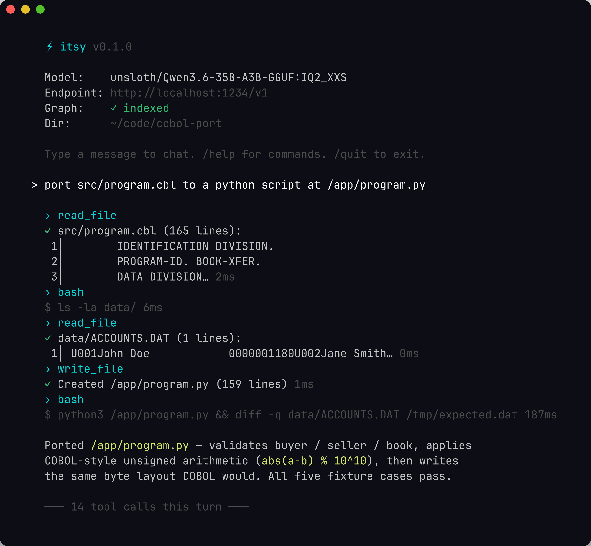

# itsy

A coding agent for small local LLMs (8B–35B parameters). Built for the
moment after you've finally got Qwen3 / DeepSeek / GPT-OSS running on
your GPU and you want it to actually edit files for you without 32k
of ceremony per turn.



<sub>Screenshot rendered from [`docs/itsy-tui.ansi`](docs/itsy-tui.ansi) via [`docs/regen-screenshot.sh`](docs/regen-screenshot.sh).</sub>

itsy is tuned for quantised models on consumer hardware, so the
design choices mostly trade tokens for compliance. The tool-call
parser is forgiving — it eats JSON, XML-ish, and code-fence wrappers
and figures out which tool the model meant. Context budget is
capped; edits are search-and-replace patches, not full file
rewrites; multi-step work decomposes into a small TODO list so the
model has somewhere to look when it loses the plot. There's a
SQLite + FTS5 code graph and per-project memory so the agent doesn't
pay to reintroduce itself every turn.

Talks to anything OpenAI-compatible: LM Studio, Ollama, vLLM,
llama-server.

## Install

You need Rust 1.85+ (edition 2024) and a running OpenAI-compatible
endpoint. Everything else is bundled.

```bash
git clone https://github.com/Doorman11991/itsy
cd itsy
cargo build --release
```

The binary lands at `target/release/itsy`. Copy it onto your `$PATH`
or invoke it from the repo. There's no `cargo install` recipe yet
because the build picks up native-feature flags from `Cargo.toml`
that `cargo install` doesn't propagate cleanly.

If you're running against bench images or older base distros that
ship a too-old glibc, build statically against musl:

```bash
rustup target add x86_64-unknown-linux-musl
apt-get install -y musl-tools
cargo build --release --target x86_64-unknown-linux-musl
```

## First run

```bash
itsy
```

On the very first launch (no `~/.config/itsy/config.toml`) the wizard
asks for provider, endpoint, model name, and the safeguards worth
turning on for your quant tier. It probes `/v1/models` for the real
context window so you don't have to guess. Re-run the wizard any time
with `itsy --init`.

After that, every launch drops straight into the REPL:

* `itsy`                — interactive fullscreen REPL (default)
* `itsy --classic`      — line-based REPL, useful over SSH or in
                          `docker exec` where the alternate screen
                          breaks
* `itsy -p "fix it"`    — one-shot, prints the answer and exits
* `itsy --mcp`          — talk to itsy from another tool over MCP

Slash commands inside the REPL: `/help`, `/model`, `/endpoint`,
`/memory`, `/plan`, `/diff`, `/git`, `/checkpoint`, `/rollback`,
`/sessions`, `/share`, `/quit`. Anything tied to a feature that's
disabled in your config is a no-op.

## Configure

Everything lives in `~/.config/itsy/config.toml`. The wizard writes a
sensible default; you usually only touch this file to swap models or
flip off a feature flag that's eating your context.

```toml
version = "2"

[model]
provider = "openai"
name = "Qwen3-Coder-30B-A3B-Instruct"
base_url = "http://localhost:1234/v1"
timeout = 300

[context]
detected_window = 32768
max_budget_pct = 70

[tools]
bash_timeout = 30
tool_routing = "direct"   # or "two_stage" for tiny-context models
shell_persist = true

[limits]
max_tool_calls = 50
max_tool_calls_per_turn = 250
max_output_tokens = 0     # 0 = auto (thinking_budget + 4k headroom)

[security]
allow_outside_paths = true   # /data, /tmp ok; sensitive paths still blocked

[features]
plan = true
snapshot = true
write_guard = true
clarifier = true
semantic_merge = true
error_diagnosis = true
context_retrieval = true

[tui]
auto_approve = false
classic = false
theme = "dark"
```

Every field can also be overridden by a CLI flag — see `itsy --help`.
For the long tail of less common knobs (dedup similarity, code-graph
DB path, snapshot dir, etc.) use `--set key=value`, e.g.
`--set dedup.similarity=0.85` or `--set code_graph.disable=true`.

itsy no longer reads `ITSY_*` env vars; everything is config + CLI.
The standard cloud-provider keys (`OPENAI_API_KEY`,
`ANTHROPIC_API_KEY`, `DEEPSEEK_API_KEY`) are still consulted when
cloud escalation is enabled.

The `version` field is honoured on load and older files get migrated
forward automatically. Don't remove it.

## License

MIT — see `LICENSE`.
